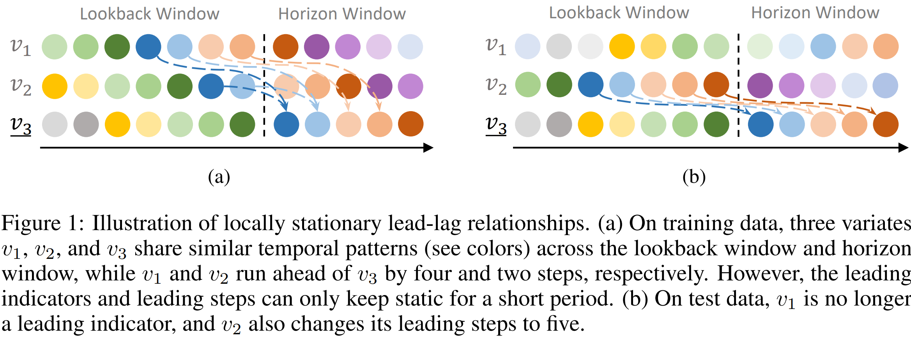

# (ICLR'24) Rethinking Channel Dependence for Multivariate Time Series Forecasting: Learning from Leading Indicators

[](https://badges.pufler.dev/visits/SJTU-Quant/LIFT)

This repo is the official Pytorch implementation of [Rethinking Channel Dependence for Multivariate Time Series Forecasting: Learning from Leading Indicators](https://arxiv.org/pdf/2401.17548.pdf). 

## Takeaways
- **Rethinking channel dependence in MTS from a perspective of lead-lag relationships.**

- **Reasoning why CD models show inferior performance.**
  - Many variates are unaligned with each other, while traditional models (*e.g.*, Informer) simply mix multivariate information at the same time step. Thus they introduce outdated information from lagged variates which are noise and disturb predicting leaders.
  - Though other models (*e.g.*, Vector Auto-Regression) memorize CD from different time steps by static weights, they can suffer from overfiting since the leading indicators and leading steps vary over time. 
- **Alleviating distribution shifts by dynamically selecting and shifting indicators.** 
  - Recent works (*e.g.*, instance normalization methods) focus on distribution shifts in statistical properties (*e.g.*, mean and variance). We take a novel investigation into a different kind of *distribution shifts in channel dependence*.
  - As the leading indicators vary over time, we evaluate all pairs between variates *as fast as possible* and dynamically select a subset from all variates. After the coarse selection, we design a neural network to finely model the channel dependence within the small subset.
  - As the leading steps vary over time, we dynamically shift the selected indicators to get aligned with the target variate, mitigating the varying misalignment.
- **A lightweight yet strong baseline for MTS forecasting.**
  - We propose a parameter-efficient baseline named LightMTS. With the parameter efficiency close to DLinear, LightMTS outperforms DLinear by a large margin and achieves SOTA performance on several benchmarks.

## Scripts
An example:
```bash
python -u run_longExp.py --dataset Weather --model DLinear --lift --seq_len 336 --pred_len 96 --leader_num 4 --state_num 8 --learning_rate 0.0005
```

The `scripts/` directory contains our scripts for re-experiments but does not cover all datasets. 
We slightly revised our method after the paper submission, while we have not re-run all experiments yet due to limited computing resources.
You can perform hyperparameter tuning on your own if necessary.

It is recommended to obtain a pretrained and frozen backbone first, in order to reduce the time cost of
selecting LIFT's hyperparameters. (Add args `--pretrain --freeze` into your scripts to load a frozen backbone.)

### Precomputing
Our implementation precomputes the leading indicators and the leading steps at all time steps over the dataset, which are saved to the `prefetch/` directory.

Given a frozen backbone, we also precompute the backbone's predictions only once and save them to the `results/` directory.

The LIFT module directly takes in the tensors of predictions without recomputing the lead-lag relationships (and the backbone's prediction if `--pretrain --freeze`). 

To avoid repeatedly loading the input tensors from RAM to GPU memory, we keep all the input tensors on the GPU memory by default.
You can set `--pin_gpu False` if your GPU memory is limited.

## Datasets
All benchmarks can be downloaded from [Google Drive](https://drive.google.com/drive/folders/1mJzKrdq-M8C0DrjHeXofcRm-3T3dJ-Gj?usp=sharing).

## Requirements
```bash
pip3 install -r requirements.txt
```

## Citation
If you find this useful for your work, please consider citing it as follows:
```
@inproceedings{
LIFT,
title={Rethinking Channel Dependence for Multivariate Time Series Forecasting: Learning from Leading Indicators},
author={Lifan Zhao and Yanyan Shen},
booktitle={The Twelfth International Conference on Learning Representations},
year={2024},
url={https://openreview.net/forum?id=JiTVtCUOpS}
}
```